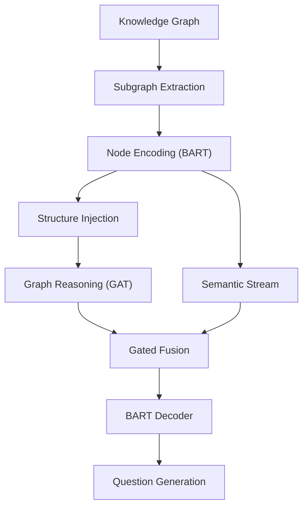

# SAGE-QG: Structure-Aware Gated Encoding for Knowledge Graph Question Generation(Research Prototype)

[](https://www.python.org/downloads/)[](https://pytorch.org/)[](LICENSE)

> **Research Prototype**: 一个基于知识图谱的多跳问题生成系统，融合了图神经网络与预训练语言模型的结构感知门控编码机制。

## 📋 目录

- [项目简介](#-项目简介)
- [核心特性](#-核心特性)
- [系统架构](#-系统架构)
- [实验设计](#-实验设计)
- [项目结构](#-项目结构)
- [环境配置](#-环境配置)
- [数据集准备](#-数据集准备)
- [模型训练](#-模型训练)
- [评估指标](#-评估指标)
- [模型评估](#-模型评估)
- [引用](#引用)

## 🎯 项目简介

SAGE-QG 是一个针对知识图谱的问题生成系统，旨在从给定的子图结构中生成自然、连贯且逻辑正确的多跳问题。本项目实现了四种不同的模型架构，通过对比实验验证了结构信息在复杂问题生成任务中的重要性。

### 主要创新点

1. **结构感知编码**：将跳数距离拓扑信息注入到模型表示中
2. **自适应门控融合**：动态平衡语义特征和图结构特征的贡献度
3. **LoRA高效微调**：使用参数高效的LoRA适配器微调BART模型
4. **LLM辅助评估**：引入大语言模型作为裁判进行质量评分

## 🚀 核心特性

- **多数据集支持**：支持 PQ, PQL, WC2014, FB15k-237, YAGO3-10, WN18RR 等多个知识图谱
- **灵活的跳数配置**：支持 2-hop 和 3-hop 推理路径生成
- **噪声注入机制**：自动添加干扰节点增强模型鲁棒性
- **完整的实验追踪**：集成 WandB 进行训练监控和可视化
- **多维度评估**：BLEU, ROUGE, METEOR, BERTScore, Distinct-N, LLM-Judge

## 🏗️ 系统架构



### 模型架构对比

| 实验     | 模型名称        | 核心特点         | 关键组件                 |
| -------- | --------------- | ---------------- | ------------------------ |
| **ExpA** | GNN-Enhanced    | 纯图神经网络增强 | GAT + Relation Embedding |
| **ExpB** | Pure BART       | 仅使用语言模型   | BART Baseline            |
| **ExpC** | Gated Fusion    | 门控融合机制     | α * GNN + (1-α) * BART   |
| **ExpD** | Structure-Aware | 结构信息注入     | Hop Distance |

## 🔬 实验设计

### Experiment A: GNN-Enhanced Model

**核心思想**：使用 Graph Attention Network (GAT) 对节点进行多跳推理增强。

**关键组件**：
- Relation Embedding：学习关系向量
- 多层 GATv2Conv：融合边信息的图注意力
- Residual Connections：防止梯度消失

### Experiment B: Pure BART Baseline

**核心思想**：仅使用 BART Encoder 的语义特征，不进行图推理。

**设计目的**：作为基线模型，验证图结构信息的必要性。

### Experiment C: Gated Fusion Model

**核心思想**：通过可学习的门控机制动态融合语义流和逻辑流。

**融合公式**：
```
α = Sigmoid(Linear([Text; Graph]))
Fused = α * Graph + (1 - α) * Text
```

**特点**：
- 模型自适应决定"看字"还是"看图"
- 提供可解释性（通过 α 值分析）

### Experiment D: Structure-Aware Model（推荐）

**核心思想**：在 ExpC 基础上注入结构信息（跳数距离）。

**结构信息**：
- **Hop Distance**：BFS 计算的跳数（0-9）

**注入方式**：
```python
x_struct = x_text + x_hop
```

## 📁 项目结构

```
qg/
├── datasets/
│   ├── background_kbs/          # 原始知识图谱文件
│   ├── processed/               # 生成的子图数据（2h, 3h）
│   └── mixed/                   # 合并后的数据集（_mix）
├── experiments/
│   ├── train.py                 # 训练主脚本
│   ├── eval.py                  # 评估主脚本
│   ├── exp_a.py                 # 实验 A：GNN 增强
│   ├── exp_b.py                 # 实验 B：BART 基线
│   ├── exp_c.py                 # 实验 C：门控融合
│   └── exp_d.py                 # 实验 D：结构感知
├── models/
│   └── bart.py                  # BART + LoRA 封装
├── metrics/
│   ├── bertscore/               # BERTScore 评估
│   ├── meteor/                  # METEOR 评估
│   └── rouge/                   # ROUGE 评估
├── utils/
│   ├── build_dataset.py         # 数据集生成
│   ├── build_vocab.py           # 关系词表构建
│   ├── mix_dataset.py           # 数据集合并
│   ├── graph_dataset.py         # PyG 数据加载器
│   └── llm.py                   # LLM API 调用
├── results/                     # 训练和评估结果
└── build_dataset.sh             # 批量数据生成脚本
```

## 🔧 环境配置

### 依赖要求

```bash
# 核心依赖
torch>=2.0.0
transformers>=4.30.0
torch-geometric>=2.3.0
datasets>=2.14.0
peft>=0.4.0

# 评估工具
evaluate
sacrebleu
nltk
bert-score

# 实验追踪
wandb
seaborn
matplotlib
pandas

# 数据处理
networkx
openai  # 用于 LLM 评估
tqdm
```

### 安装步骤

```bash
# 1. 克隆仓库
git clone https://github.com/Episode233/SAGE-QG.git
cd qg

# 2. 创建虚拟环境
conda create -n kgqg python=3.8
conda activate kgqg

# 3. 安装依赖
pip install torch torchvision torchaudio --index-url https://download.pytorch.org/whl/cu118
pip install torch-geometric
pip install transformers datasets peft evaluate wandb

# 4. 下载 BART 模型（如需离线使用）
# 将 facebook/bart-base 下载到 models/bart-base/
```

## 📊 数据集准备

### 步骤 1：准备原始知识图谱

将您的知识图谱文件（`.txt` 格式）放入 `datasets/background_kbs/` 目录。

**文件格式**：每行一个三元组，使用制表符分隔
```
头实体\t关系\t尾实体
Obama\tborn_in\tHawaii
Hawaii\tlocated_in\tUSA
```

### 步骤 2：生成训练数据

使用 `build_dataset.py` 自动生成子图样本并调用 LLM 生成问题：

```bash
# 单个数据集生成示例
python utils/build_dataset.py -k PQ --hops 2 --attempts 10 --noise 3 --samples 10000

# 批量生成（推荐）
bash build_dataset.sh
```

**参数说明**：
- `-k, --kb`：知识图谱文件名（例如 `PQ.txt`）
- `--hops`：推理跳数（2 或 3）
- `--attempts`：每个起点的采样尝试次数
- `--noise`：每个节点添加的噪声邻居数量
- `--samples`：目标采样的起点节点数量

### 步骤 3：合并多跳数据集

将同一知识图谱的 2-hop 和 3-hop 数据合并：

```bash
python utils/mix_dataset.py
```

这会自动扫描 `datasets/processed/` 目录，将 `PQ_2h` 和 `PQ_3h` 合并为 `PQ_mix`。

### 步骤 4：构建关系词表

为每个混合数据集生成关系到ID的映射：

```bash
python utils/build_vocab.py -d PQ_mix
python utils/build_vocab.py -d PQL_mix
python utils/build_vocab.py -d WC2014_mix
```

## 🏋️ 模型训练

### 基础训练命令

```bash
python experiments/train.py \
    -e <实验名称> \
    -d <数据集名称> \
    --batch_size 128 \
    --epochs 100 \
    --patience 5 \
    --lr 5e-4 \
    --gnn_layers 3 \
    --dropout 0.1
```

### 实验参数说明

| 参数                 | 说明               | 默认值 | 推荐范围              |
| -------------------- | ------------------ | ------ | --------------------- |
| `-e, --exp_name`     | 实验类型 (a/b/c/d) | a      | -                     |
| `-d, --dataset`      | 数据集名称         | -      | PQ_mix, PQL_mix, etc. |
| `--epochs`           | 最大训练轮数       | 100    | 50-200                |
| `--patience`         | 早停耐心值         | 5      | 3-10                  |
| `--batch_size`       | 批次大小           | 128    | 32-256                |
| `--lr`               | 学习率             | 5e-4   | 1e-4 to 1e-3          |
| `--gnn_layers`       | GNN层数            | 3      | 2-4                   |
| `--grad_accum_steps` | 梯度累积步数       | 1      | 1-4                   |

### 训练示例

```bash
# Experiment A (GNN-Enhanced)
python experiments/train.py -e a -d PQ_mix --batch_size 32 --patience 10

# Experiment B (Pure BART)
python experiments/train.py -e b -d PQ_mix --batch_size 32 --patience 10

# Experiment C (Gated Fusion)
python experiments/train.py -e c -d PQL_mix --batch_size 32 --patience 10

# Experiment D (Structure-Aware) - 推荐配置
python experiments/train.py -e d -d WC2014_mix --batch_size 128 --patience 5
```

### 训练监控

训练过程会自动记录到 WandB：
- **Train Loss**：训练损失曲线
- **Val Loss**：验证损失曲线
- **Learning Rate**：学习率调度
- **Alpha Statistics**（ExpC/ExpD）：门控系数的均值、标准差、最小值、最大值
- **Generation Samples**：每个 epoch 的生成样例

### 输出结果

训练完成后，模型权重和日志会保存在 `results/` 目录：

```
results/
└── <exp_name>_<dataset>_<timestamp>/
    ├── best_model.pt           # 最佳模型权重
    ├── loss_curve.png          # 损失曲线图
    └── training_log.csv        # 训练日志
```

## 📊 评估指标

### 自动指标

| 指标             | 含义                         | 评估维度   |
| ---------------- | ---------------------------- | ---------- |
| **BLEU**         | N-gram 匹配度                | 生成精度   |
| **ROUGE-1/2/L**  | 召回率（单词/双词/最长序列） | 覆盖度     |
| **METEOR**       | 考虑同义词的匹配             | 语义相似度 |
| **BERTScore**    | 基于 BERT 的语义相似度       | 深层语义   |
| **Distinct-1/2** | 不重复 1/2-gram 比例         | 多样性     |

### LLM-Judge 评估

使用 GPT-4o-mini 作为裁判，从五个维度打分（总分 100）：

1. **Fluency & Grammar**（0-20 分）：语法流畅性
2. **Faithfulness**（0-20 分）：是否忠实于图上下文
3. **Logical Correctness**（0-20 分）：逻辑是否通顺
4. **Constraints Compliance**（0-20 分）：是否符合多跳约束且未泄露答案
5. **Semantic Alignment**（0-20 分）：与参考问题的语义一致性

## 📈 模型评估

### 评估命令

```bash
python experiments/eval.py \
    -e <实验名称> \
    -d <数据集名称> \
    -c <模型权重路径> \
    --batch_size 256 \
    --num_beams 4 \
    --llm_limit 200
```

### 参数说明

- `-e, --exp_name`：实验类型（a/b/c/d）
- `-d, --dataset`：测试数据集名称
- `-c, --checkpoint`：训练好的模型路径（`best_model.pt`）
- `--num_beams`：Beam Search 宽度（推荐 4-5）
- `--llm_limit`：LLM 评估的样本数量（-1 表示全量评估）

### 评估示例

```bash
python experiments/eval.py \
    -e d \
    -d PQ_mix \
    -c results/d_PQ_mix_20251217_1605/best_model.pt \
    --batch_size 256 \
    --num_beams 4 \
    --llm_limit 200
```

### 输出结果

评估完成后会生成：

```
results/<exp_name>_<dataset>_<timestamp>/
├── test_predictions.csv    # 生成结果 + LLM 评分
└── test_metrics.txt        # 汇总指标
```

**CSV 文件包含**：
- `Generated`：模型生成的问题
- `Reference`：标准答案问题
- `LLM_Score`：LLM 打分（0-100）
- `LLM_Reason`：LLM 评分理由

## 🎓 Notes

### 关键技术细节

1. **LoRA 微调策略**：仅微调 BART 的 `q_proj` 和 `v_proj`，冻结其他参数，显著降低显存占用。

2. **双向边处理**：所有边都会被复制为正向和反向（带 `_inv` 后缀），增强图连通性。

3. **动态结构计算**：跳数信息在数据加载时实时计算（BFS），无需预处理。

4. **Early Stopping**：使用验证集损失触发早停，避免过拟合。

### 推荐配置

**小数据集（PQ, PQL, WC2014）**：
```bash
--batch_size 32
--patience 10
--grad_accum_steps 1
--lr 5e-4
```

**大数据集（FB15k-237, YAGO3-10, WN18RR）**：
```bash
--batch_size 128
--patience 5
--grad_accum_steps 1
--lr 5e-4
```

### 常见问题

**Q: CUDA Out of Memory？**
- 减小 `batch_size` 或增加 `grad_accum_steps`
- 在 `DataLoader` 中减少 `num_workers`

**Q: 训练速度慢？**
- 启用 `pin_memory=True`（已默认开启）
- 使用混合精度训练（需自行添加 `torch.cuda.amp`）

**Q: LLM 评估失败？**
- 检查 `utils/llm.py` 中的 API Key 配置
- 确认 OpenRouter 额度充足

## 📝 License

本项目采用 MIT License 开源协议。

## 🤝 致谢

- **BART**：Facebook AI Research 的预训练模型
- **PyTorch Geometric**：图神经网络框架
- **HuggingFace**：Transformers 和 Datasets 库
- **WandB**：实验追踪平台